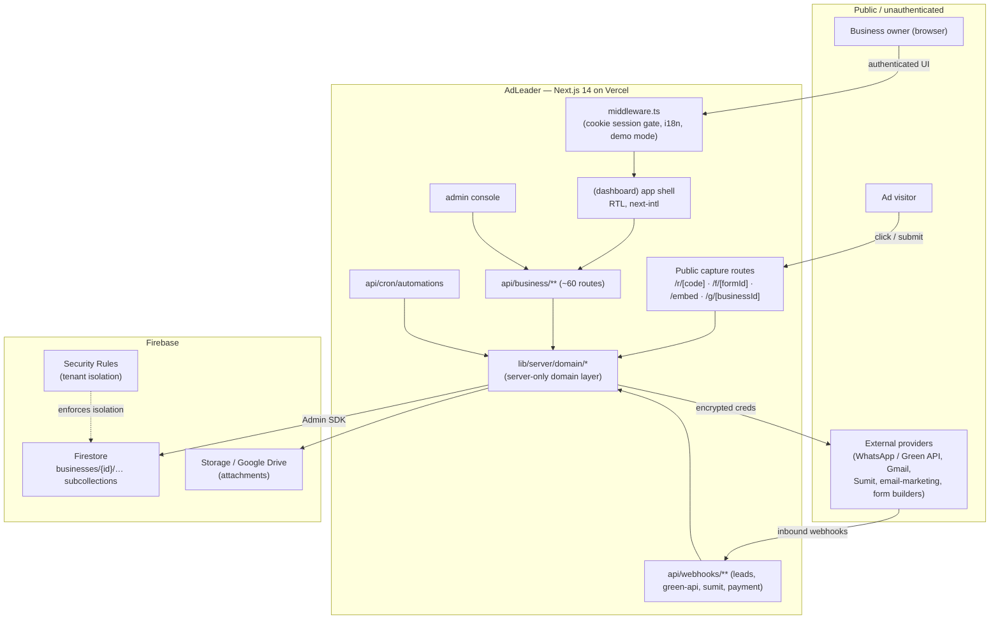
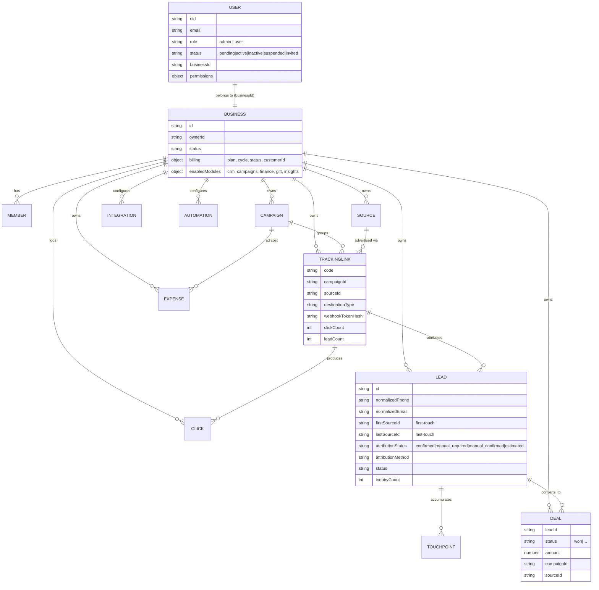
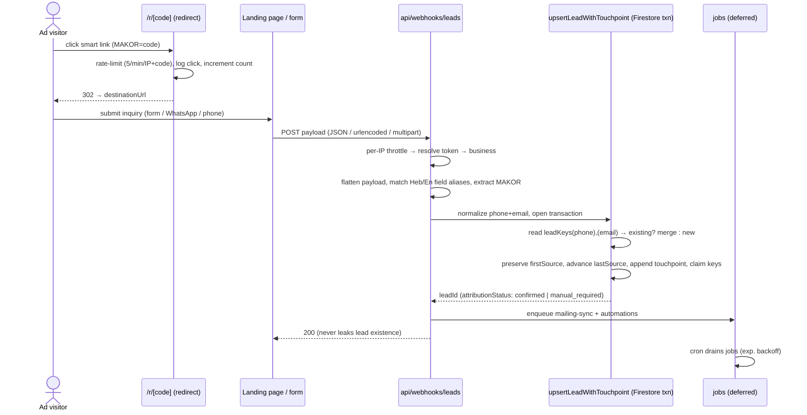
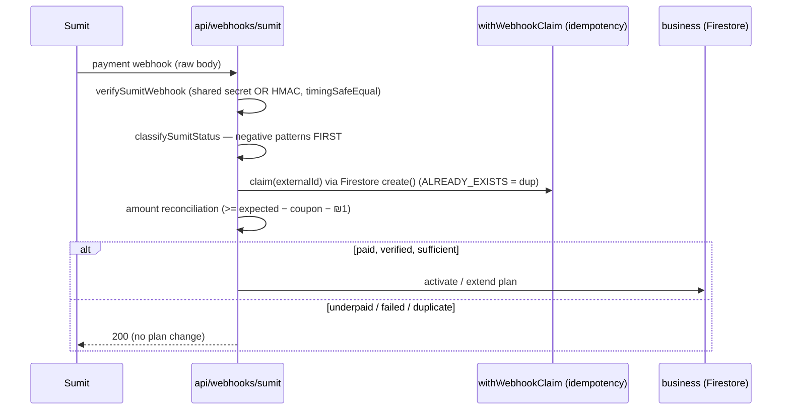
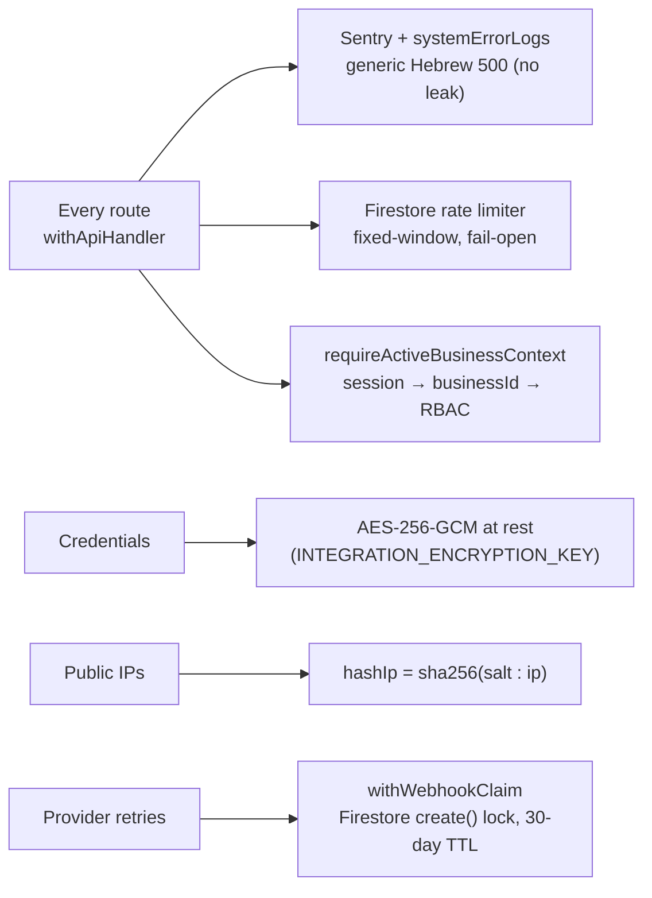
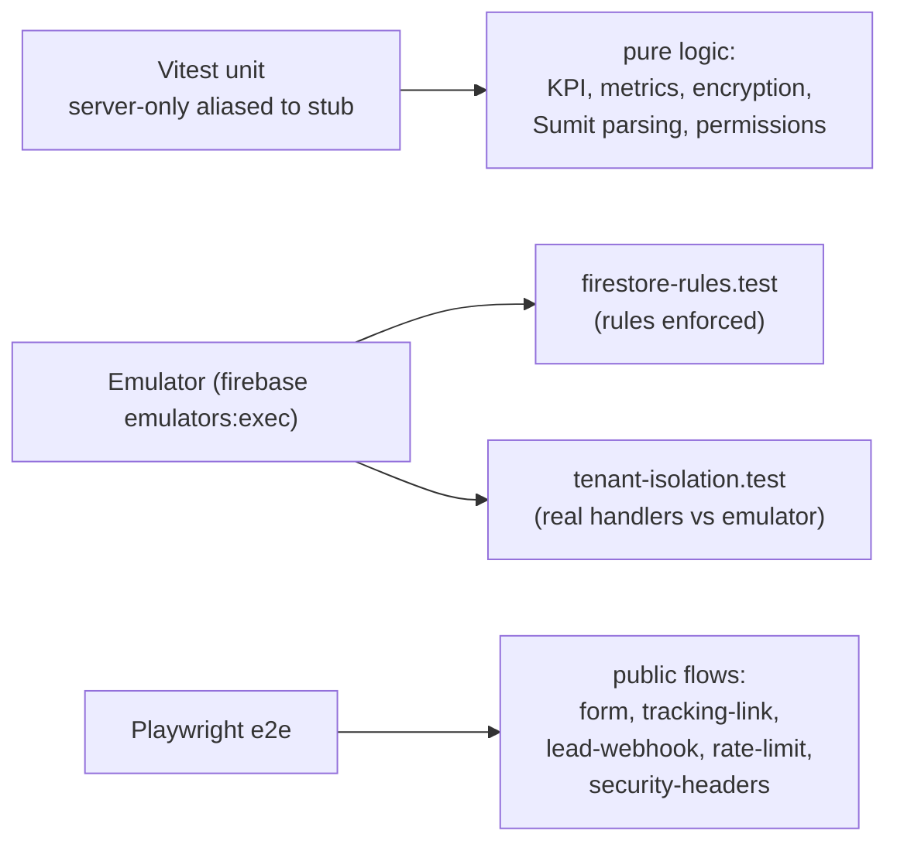

# Architecture — AdLeader

Next.js 14 (App Router) + Firebase, TypeScript, Hebrew RTL, multi‑tenant. Deploy target: Vercel
(serverless) + Firebase (Firestore rules/indexes, Storage rules). Every claim below is verified
against source.

---

## 1. System context

**Key idea:** the browser and public callers never touch Firestore directly for writes. Everything
funnels through the **server‑only domain layer** (`import "server-only"`), which derives the tenant
from the session and builds every path from `businessRef(businessId)`. Firestore security rules make
`businesses` **read‑only to clients** and lock sensitive subcollections entirely, so the rules are a
second wall behind the domain layer, not the primary one.

### Route groups (`app/`)

| Group | Purpose |
| --- | --- |
| `(auth)/` | `login`, `register`, `invite/[token]` |
| `(dashboard)/` | tenant app shell: `dashboard`, `leads`, `crm/*`, `campaigns`, `sources`, `tracking-links`, `reports`, `business-dashboard`, `communications`, `integrations`, `settings/*`, `billing`, `gift`, `automations` |
| `admin/` | platform‑operator console (`users`, `invitations`, `coupons`, `costs`, `logs`, `support`) |
| `api/business/**` · `api/admin/**` · `api/webhooks/**` | tenant API · platform API · inbound webhooks |
| root public | `r/[trackingCode]` (redirect), `f/[formId]` + `embed/[formId]` (forms), `g/[businessId]` (gift) |

`middleware.ts` is cookie‑only (no Firestore at the edge): it checks the `firebase-token` cookie for
presence to gate protected paths, handles demo mode, and confines pending/suspended users. It is
wrapped in try/catch that falls through to `NextResponse.next()` so a middleware crash can never take
down every page. **Real authorization happens server‑side in route handlers**, verified with
`verifySessionCookie(cookie, true)`.

---

## 2. Multi‑tenant data model

A tenant is a **business**. Every tenant entity is a subcollection under `businesses/{businessId}`; a
`users/{uid}` doc carries exactly one `businessId`, mirrored in `businesses/{id}/members/{uid}`.

**Identity index:** a top‑level `leadKeys/{kind:value}` collection maps `phone:…` / `email:…` → a
`leadId`, so the atomic upsert can de‑duplicate returning inquiries inside a transaction. Other
top‑level lookup/lock collections: `trackingLinkCodes`, `trackingLinkWebhookTokens`,
`paymentWebhookTokens`, `rateLimits`, `webhookEvents` (idempotency), `jobs` (deferred work),
`invites`, `adminActivityLogs`, `systemErrorLogs`. `firestore.indexes.json` defines 13 composite
indexes for the hot query paths (leads by status/updatedAt, deals by status/closedAt, messages by
leadId/createdAt, clicks by campaignId/createdAt, jobs by status/runAfter …).

> **Two type systems, one live.** `lib/types.ts` (a `userId`‑based scaffold model) is dead — only
> demo data and the KPI library import it. The live model is the untyped‑at‑rest, business‑scoped
> data constructed in `lib/server/domain/*.ts`.

---

## 3. Key flow — lead capture and attribution

If the `MAKOR` code resolves to a tracking link of the **same** business, the lead is
`attributionStatus: "confirmed"`, `attributionMethod: "tracking_link"`; otherwise `manual_required`,
surfaced in the UI as "דורש שיוך ידני". Side effects (email‑marketing sync, automations) are deferred
to the `jobs` collection so the webhook can answer immediately.

---

## 4. Key flow — billing webhook (defense in depth)

`classifySumitStatus` checks failure patterns (`unpaid|invalid|declin|fail…`) *before* success ones,
so an "InvalidCard"/"Unpaid" status can never be misread as a payment. A charge below
`expected − allowed coupon discount − ₪1 tolerance` will not activate a plan.

---

## 5. Cross‑cutting concerns

- **Server/client split:** `firebase-admin`, gRPC/protobuf, `nodemailer`, `xlsx`, `jspdf`, `resend`,
  `isomorphic-dompurify`, `@sentry/node` are marked `serverComponentsExternalPackages` in
  `next.config.js`. `instrumentation.ts` validates env once per server start.
- **RBAC** (`lib/auth/permissions.ts`): 40+ `PermissionAction`s; every active member does daily work,
  an `OWNER_ONLY_BY_DEFAULT` set (deletes, exports, integrations, billing, members, automations) is
  owner‑only, per‑user `permissions` overrides, platform admin via custom claim.
- **Security headers** (`next.config.js`): HSTS, `X-Content-Type-Options`, `Referrer-Policy`,
  `Permissions-Policy`, `X-Frame-Options: DENY` + CSP `frame-ancestors 'none'` everywhere except
  `/embed/*` (intentionally embeddable).

---

## 6. Testing topology

Roughly 30 `*.test.ts` files. The emulator suite runs **real App Router handlers** against a Firestore
emulator with only the session layer mocked, so cross‑tenant access is proven to fail at both the
rules layer and the handler layer.
