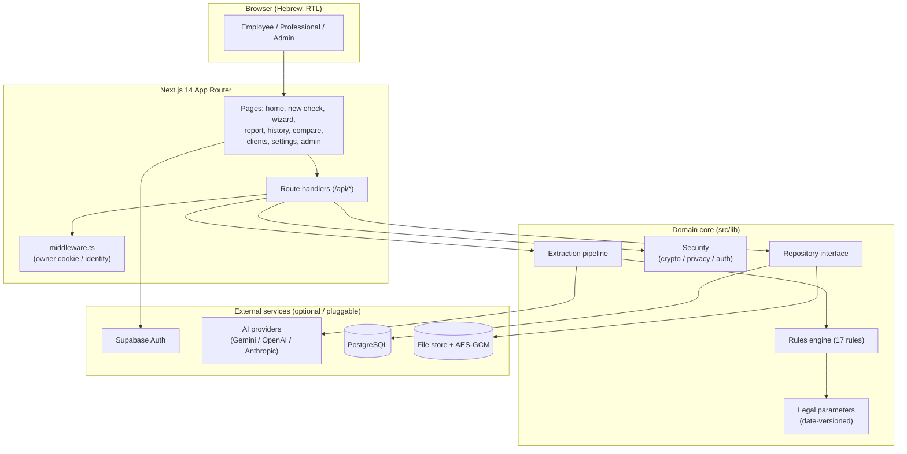
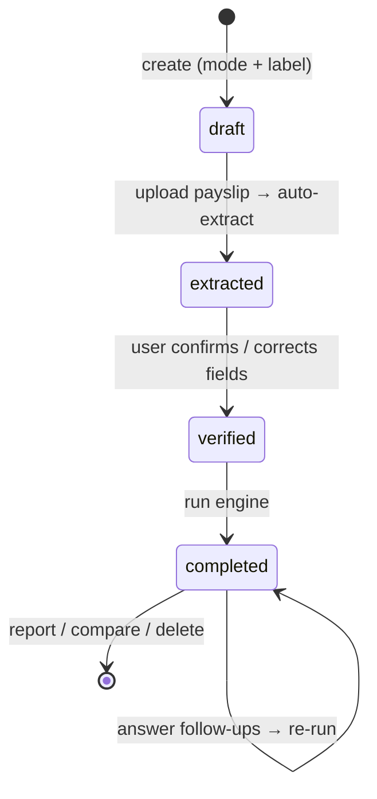
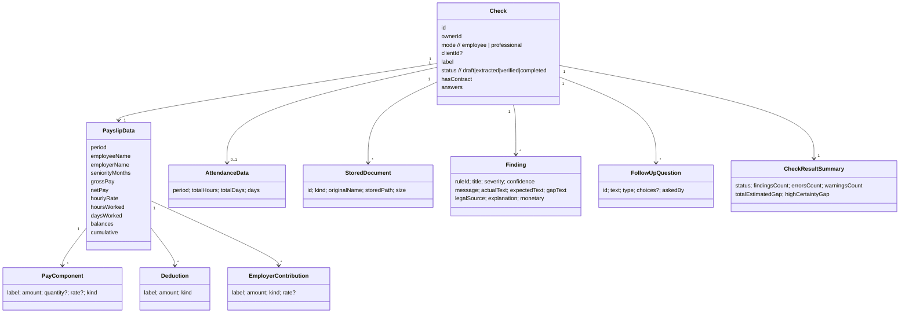
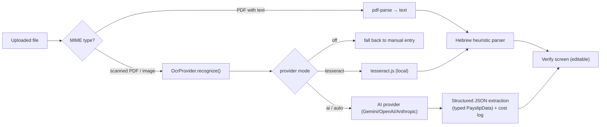
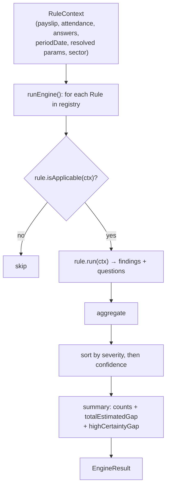
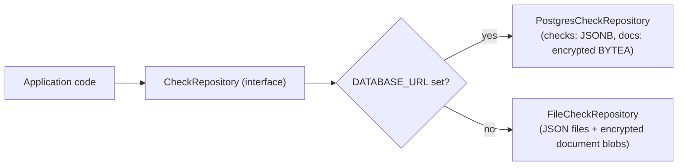

# Architecture — Payslip Check

This document describes the system as built. All claims map to the codebase
(`src/app`, `src/lib/engine`, `src/lib/law`, `src/lib/extraction`, `src/lib/store`,
`src/lib/security`, `src/lib/auth`).

---

## 1. System context

The browser talks only to Next.js pages and route handlers. The domain core is pure TypeScript and
has no framework coupling: the engine, the extraction pipeline, and the legal parameters can be unit
tested in isolation (and are, under Vitest).

---

## 2. The check lifecycle (state machine)

A `Check` moves through four states; the wizard mirrors them.

- **draft** — created, no documents yet.
- **extracted** — a document was uploaded and parsed; awaiting human verification.
- **verified** — the user confirmed or corrected the extracted data.
- **completed** — the engine ran; findings, follow-up questions, and a summary exist. Answering a
  follow-up re-runs the engine on the same check.

---

## 3. Data model (core domain types)

The `Check` is the aggregate root; the repository persists it whole (as a file, or as a JSONB row in
PostgreSQL). Raw documents are stored separately and referenced by `storedPath`.

---

## 4. Extraction pipeline

Text-layer PDFs are parsed directly; scanned documents go through an injected `OcrProvider`. When an
AI provider is configured, extraction can return typed JSON directly (more accurate than parsing
text) and logs the model and cost per use. **Every path lands on the editable verify screen** — the
human is always in the loop before the engine judges anything.

---

## 5. Rules engine

Rules are registered in `engine/registry.ts`; the runner is agnostic to them. Each rule pulls the
legal values it needs from the date-resolved parameter set (managed values override code constants),
emits findings with confidence and monetary impact, and may emit follow-up questions that are
de-duplicated across rules.

**The 17 rules:** minimum wage · split-rate · teaching-sector degree · teaching-sector seniority ·
overtime · pension · convalescence · vacation · sick pay · severance · holiday pay · contract bonus
· study fund · income-tax sanity · travel · attendance cross-check · gross/net/deduction
consistency.

---

## 6. Storage abstraction

One interface, two implementations, chosen at runtime by the presence of `DATABASE_URL`. The rest of
the system depends only on the interface. A parallel `adminStore` (file + PostgreSQL) holds profiles,
the audit log, and usage records.

---

## 7. Security & identity

- **Encryption at rest** — documents (and stored AI keys) are encrypted with AES-256-GCM
  (`security/crypto.ts`); the key comes from `PAYSLIP_ENC_KEY` in production.
- **Owner isolation** — every `Check` carries an `ownerId`; access is denied to non-owners.
- **ID masking** — national IDs are masked to their last four digits in list views
  (`security/privacy.ts`).
- **Auth & roles** — Supabase Auth (Google / email-password); roles `admin` / `professional` /
  `employee`, with an admin "view-as" read-only mode and an audit trail.
- **Retention** — a retention window underpins proactive/automatic document deletion.
