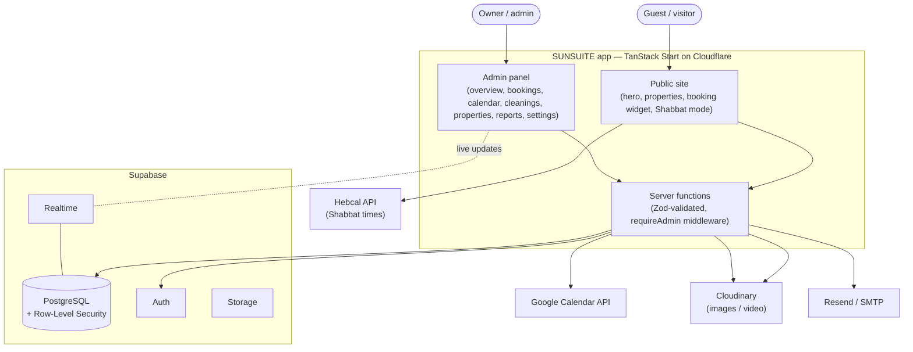
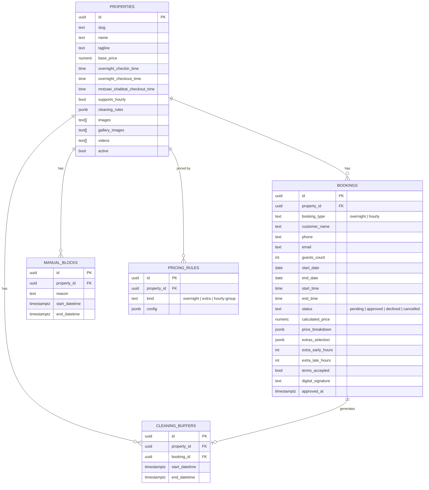
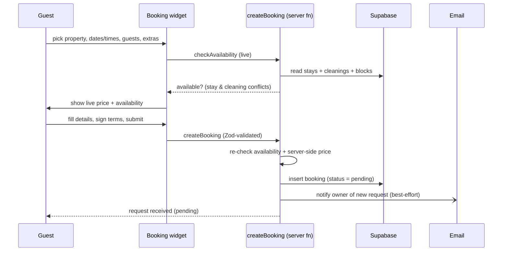
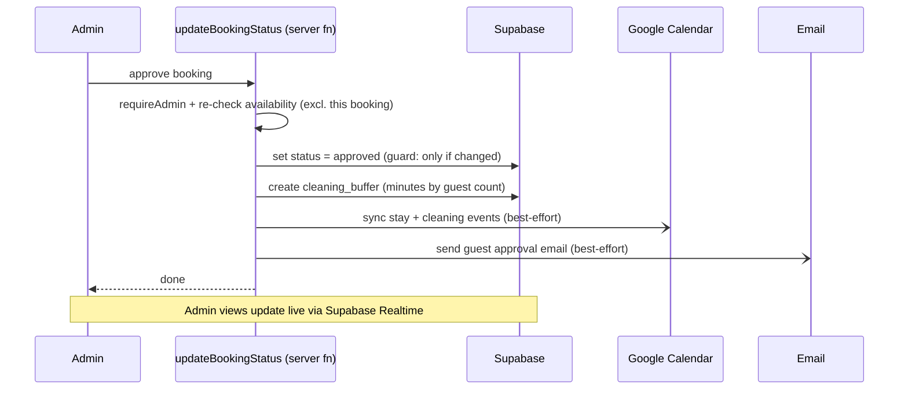
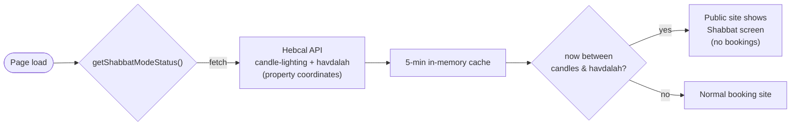

# Architecture — SUNSUITE

SUNSUITE is a server-rendered React application (TanStack Start) whose backend is
a set of type-safe **server functions** talking to Supabase (PostgreSQL) and a
handful of external services. Everything runs on Cloudflare.

## System context

## Data model (core tables)

> Notes: linked units (`sunsuite` + `sunspa`) are treated as one availability
> group for overnight bookings so the shared complex can't be double-booked.
> `cleaning_rules` is stored per-property as JSON (guest-count → minutes).

## Key flow 1 — Guest booking request

## Key flow 2 — Owner approves (the automation)

## Key flow 3 — Shabbat mode

## Cross-cutting concerns

- **Validation & auth:** every server function validates input with Zod; admin
  actions run behind a `requireAdmin` middleware plus per-property scope checks.
- **Realtime:** admin screens subscribe to Postgres changes so the queue, calendar
  and dashboard refresh without reloads.
- **Time correctness:** overnight bookings use naive local date/time; cleanings and
  blocks use UTC timestamps. Calendar bucketing reads local hours from both so a
  day renders chronologically.
- **Resilience:** external calls (Calendar, email, media) are wrapped so failures
  are logged and ignored rather than failing the core transaction.
