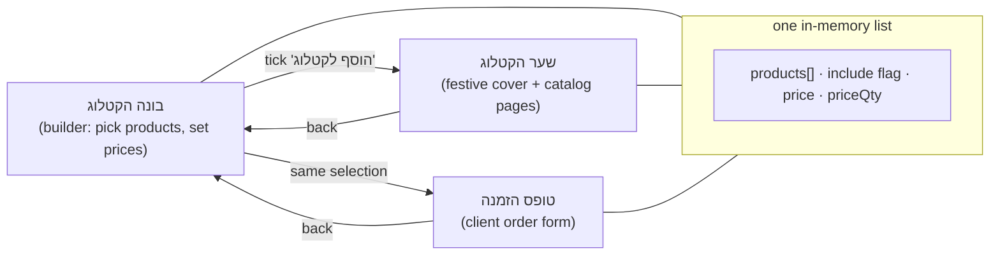
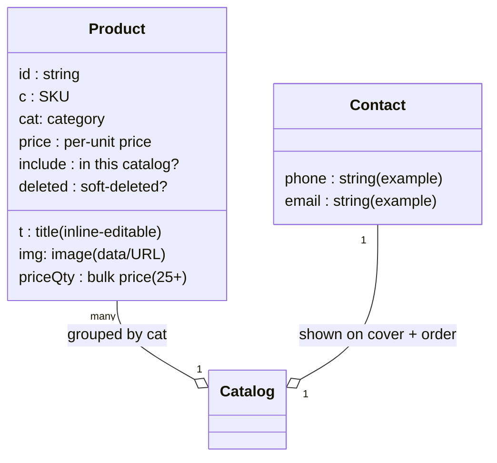

# Architecture — תוכי פרינט · בונה הקטלוג

The demo is a single self-contained HTML/CSS/JS file with three screens driven by one
in-memory product list. Selecting a product in the builder flows straight into the
catalog cover and the order form.

## Screen flow

## Product data model (demo)

## Key rules

- **Selection is the single source of truth.** `include` on each product drives what
  appears on the cover, the catalog pages and the order form — no duplicated lists.
- **Grouping & order.** Products are bucketed by `cat`; categories render in a fixed
  configured order, with any extra categories appended.
- **Bulk pricing.** A threshold (`TH = 25`) chooses the price: quantity ≥ 25 uses the
  bulk price when set, otherwise the per-unit price.
- **Dates.** The cover shows both the Gregorian month/year and the Hebrew-calendar date
  via `Intl.DateTimeFormat('he-u-ca-hebrew', …)`.
- **Autosave UX.** Every edit flips a small "שומר… → נשמר" indicator (the demo keeps
  state in memory; production would persist).
- **Client-side only.** No network calls; the demo runs offline by double-click.
