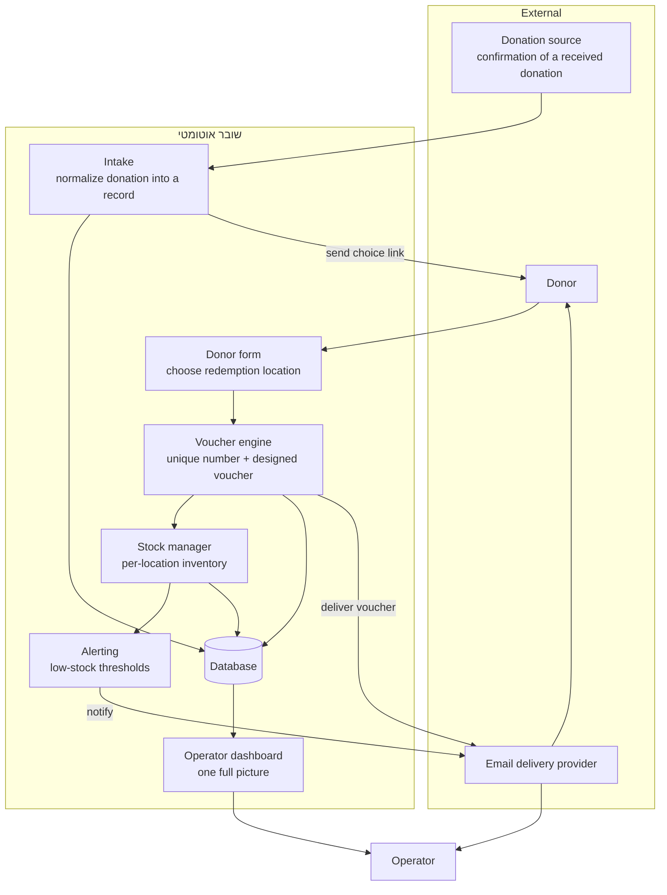
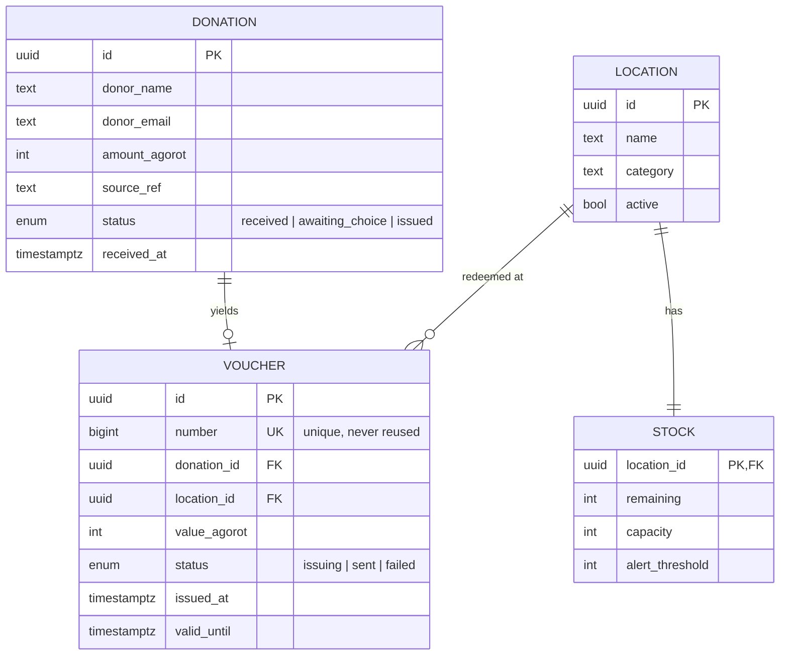
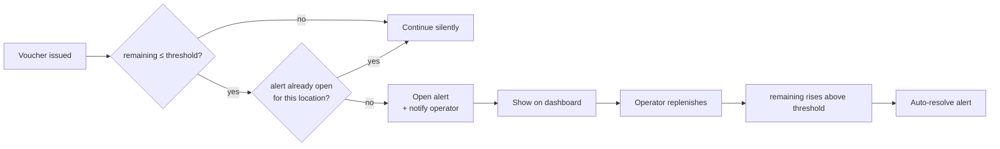

# Architecture — שובר אוטומטי

> **Reference architecture.** This describes a representative, buildable implementation of
> the described workflow. It is technology-neutral where it can be; concrete choices
> (PostgreSQL, an email provider, a job runner) are shown as one sound way to build it, not
> as a claim about a specific deployed stack.

---

## 1. System context

How the pieces relate: the donation source feeds the system, the donor interacts through a
form, and the system produces and delivers vouchers while keeping the operator informed.



**Key idea:** the operator is *out of the critical path*. They no longer act to produce a
voucher — they only receive alerts and observe. The donor's choice is the only human input,
and it comes from the donor, not the operator.

---

## 2. Data model

Three core entities plus a per-location stock counter. Deliberately small.



Notes:

- **Money is stored in agorot (integer).** Never floats for currency.
- **`VOUCHER.number` is a unique key.** The database enforces no duplicates — the guarantee
  does not rely on application code being careful (see deep-dive 1).
- **`STOCK` is one row per location**, holding `remaining`, `capacity`, and the
  `alert_threshold` that drives alerting.

---

## 3. Key flow — donation to delivered voucher

The heart of the system. Steps 3–6 are fully automatic.

```mermaid
sequenceDiagram
    autonumber
    participant Src as Donation source
    participant Sys as System
    participant Donor
    participant DB as Database
    participant Mail as Email

    Src->>Sys: donation received (name, amount, contact)
    Sys->>DB: create DONATION (status: awaiting_choice)
    Sys->>Donor: email with a link to the choice form
    Donor->>Sys: submit chosen location
    Note over Sys,DB: single atomic transaction
    Sys->>DB: reserve unique voucher number
    Sys->>DB: decrement STOCK.remaining (guarded ≥ 0)
    Sys->>DB: create VOUCHER (status: issuing)
    Sys->>Sys: render designed voucher
    Sys->>Mail: send voucher to donor
    Mail-->>Sys: accepted
    Sys->>DB: VOUCHER.status = sent; DONATION.status = issued
    Sys->>DB: if STOCK.remaining ≤ threshold → raise alert
```

The steps inside the transaction (reserve number, decrement stock, create voucher) either
**all succeed or none do**. That is what makes it safe to run without a human watching:
there is no partial state where a number was consumed but no voucher exists, or stock was
sold but the voucher wasn't recorded. See deep-dive 2.

---

## 4. Low-stock alerting



Alerting is **edge-triggered and de-duplicated**: crossing the threshold opens exactly one
alert per location, not one per issued voucher. Replenishing above the threshold resolves it
automatically. This keeps the operator informed without noise. See deep-dive 3.

---

## 5. Component responsibilities

| Component | Responsibility | Never does |
|-----------|----------------|------------|
| **Intake** | Turn an incoming donation into a normalized record | Decide the redemption location |
| **Donor form** | Capture the donor's chosen location | Assign numbers or touch stock |
| **Voucher engine** | Reserve a unique number, render, hand off to email | Proceed if stock is unavailable |
| **Stock manager** | Own `remaining` per location; guard against overselling | Silently go negative |
| **Alerting** | Watch thresholds; open/resolve alerts once | Spam per-voucher notifications |
| **Dashboard** | Present the whole picture read-only | Be required to produce a voucher |

---

## 6. Reference stack (one sound choice)

| Concern | Choice | Why |
|---------|--------|-----|
| Data | PostgreSQL | Transactions + unique constraints make the atomic issue trivial to guarantee |
| App / API | Node.js (or any transactional backend) | Simple request/transaction model |
| Numbering | DB sequence or `SELECT … FOR UPDATE` counter | Uniqueness enforced by the database, not by hope |
| Voucher render | HTML → PDF (server-side) | Designed, portable, email-friendly |
| Email | Transactional email provider (SMTP/API) | Reliable delivery + delivery status |
| Scheduling | A small job runner | Retries for email; periodic reconciliation |

The choices matter less than the **shape**: a single transactional store, one atomic issue
operation, and edge-triggered alerting.
