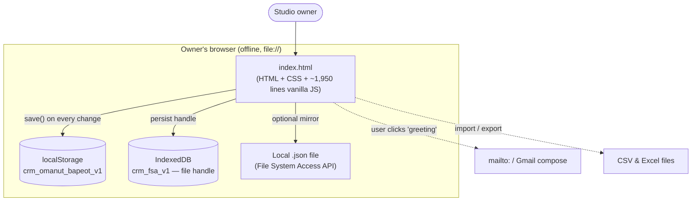
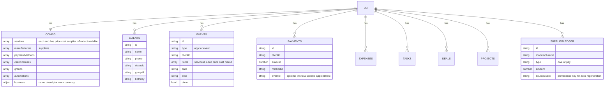
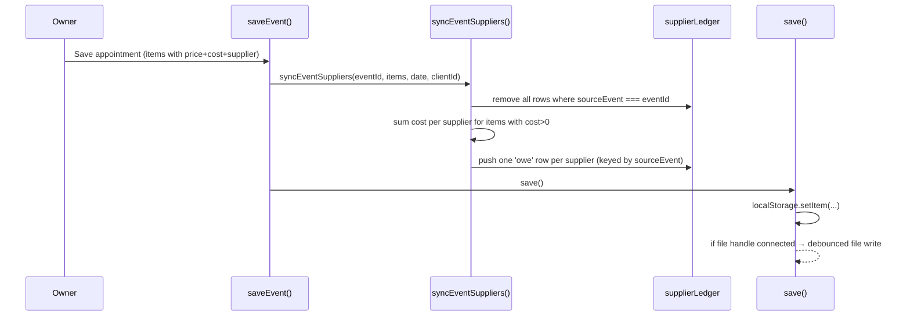
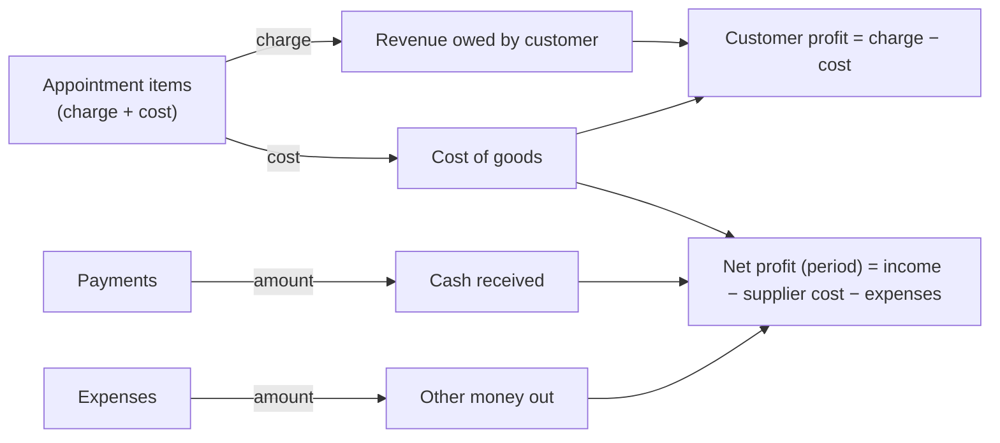
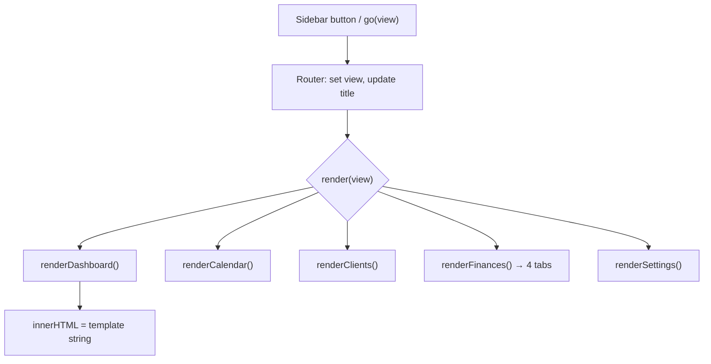
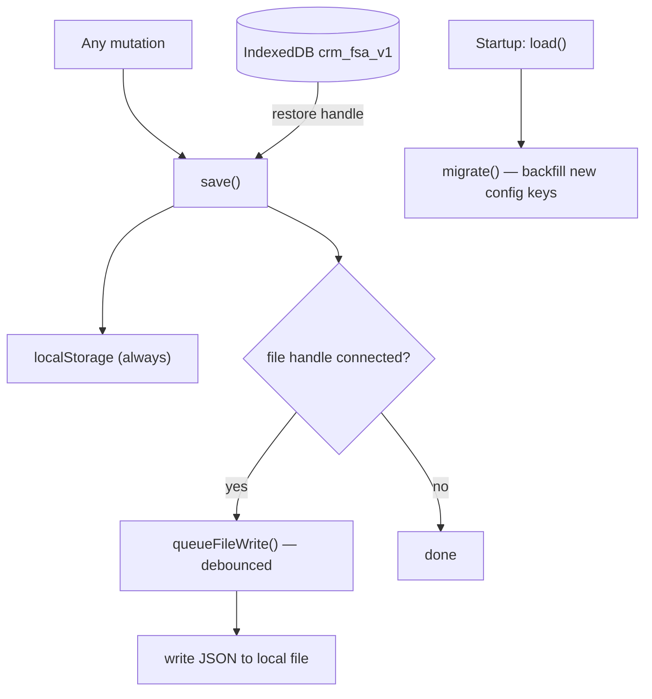

# Architecture — Wig CRM (אומנות בפאות)

A single-file, offline-first, dependency-free web application. There is no server, no
database engine, and no build step. This document describes how the one HTML file is
organized, how data flows, and how the core money logic stays consistent.

---

## 1. System context

The entire product is one HTML file the owner opens in a browser. The only optional external
touch points are the browser's own storage APIs and a user-initiated email client (for
sending a greeting). Nothing leaves the machine automatically.



Key properties:

- **No network dependency.** Fonts degrade gracefully to system fonts; the logo and favicon
  are base64-inlined; there are no script or style CDNs required for the app to function.
- **Single source of truth.** All state is one in-memory object, `db`, serialized to JSON.

---

## 2. Data model

All data lives in one object. `config` holds the editable "shape" of the business (price
list, suppliers, statuses, automations, branding); the rest are records.



The crucial modelling choice: **cost and supplier are properties of the sub-service** (the
product line in the price list), and are copied onto an appointment's `items[]` at sale
time. Payments carry no cost/supplier fields at all — a payment is purely money in.

---

## 3. Appointment → supplier ledger flow

When an appointment is saved, its supplier charges are **rebuilt deterministically** from
its items. This delete-then-rebuild keyed by `sourceEvent` guarantees the ledger always
matches what was actually sold, even after edits.



Supplier balance is then simply:

```
balance(supplier) = Σ owe(supplier) − Σ pay(supplier)
```

A negative balance is a credit (prepaid stock), which the model supports.

---

## 4. Money semantics

Four independent quantities, deliberately kept separate so partial payments never distort
anything:



- **Customer profit** uses *charge* minus cost, not *paid* minus cost — so a deposit today
  and the balance next month does not misstate profit.
- **Debt** for an appointment = `evTotal(appointment) − paymentsTiedToIt`.

---

## 5. Rendering & routing

No framework. A tiny router swaps the visible screen and calls that screen's render
function, which returns an HTML string built with template literals.



Rendering is idempotent: every screen is a pure function of `db`, so any mutation followed by
a re-render reflects the new state. Modals (forms) are shown with a `showModal(html, size)`
helper and never close on an outside click, to prevent accidental data loss.

---

## 6. Persistence



- `storageMode` is `'local'` or `'file'`.
- `migrate()` makes older saved documents forward-compatible by backfilling any missing
  `config` sections and defaulting new fields (e.g. `cost`, `manufacturerId`).
- JSON backup/restore and CSV/Excel import-export provide additional safety and portability.
