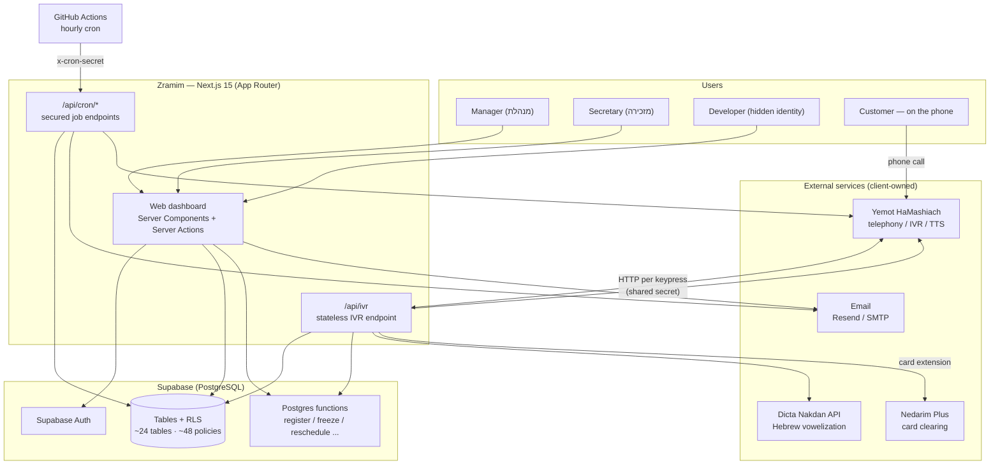
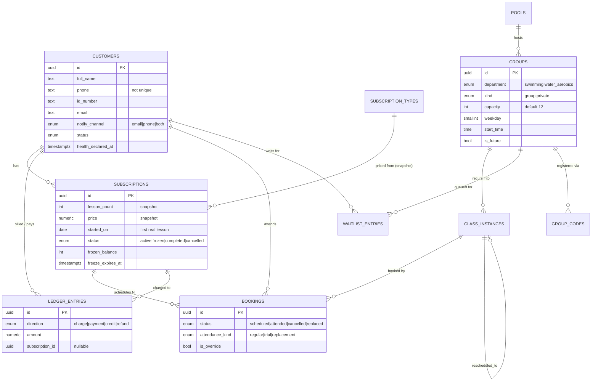
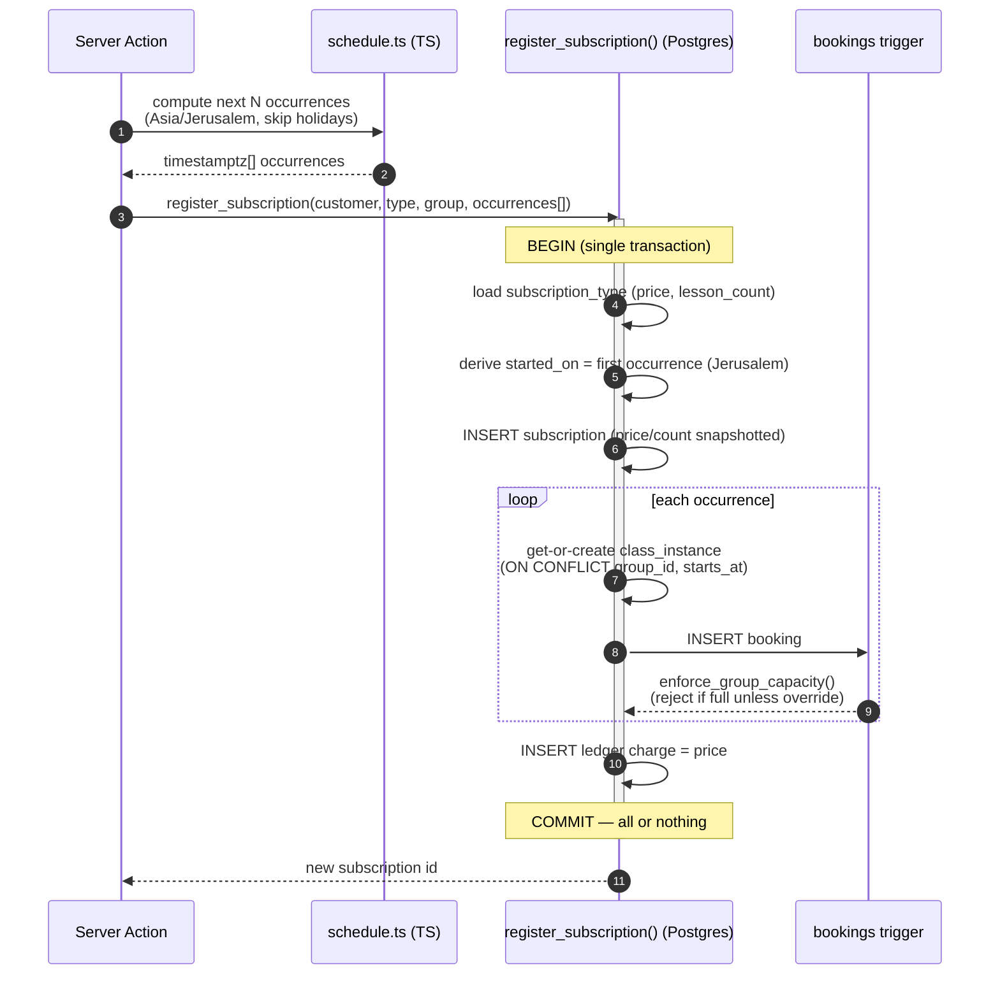
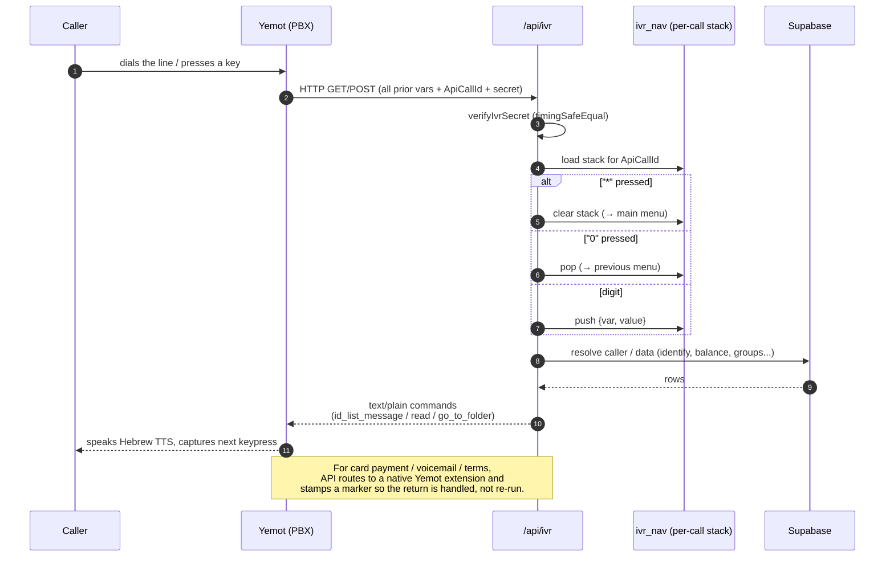
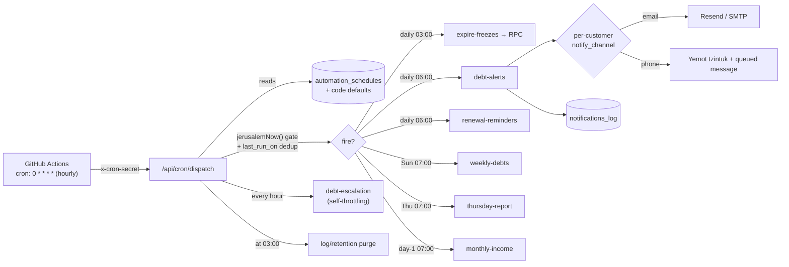
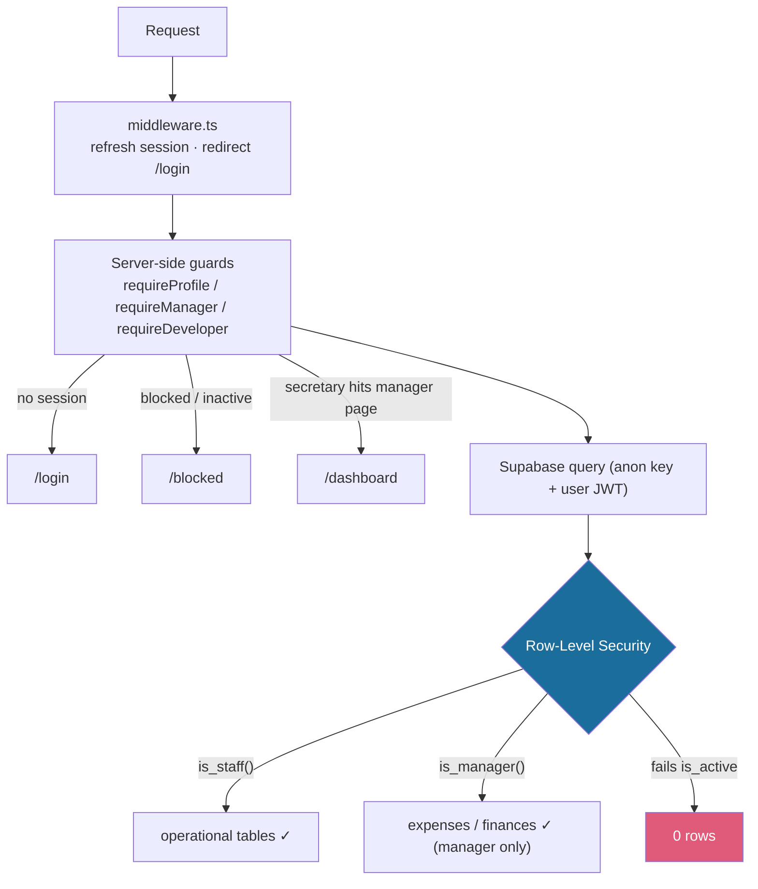

# Zramim — Architecture

All diagrams are [Mermaid](https://mermaid.js.org/). GitHub, GitLab, Obsidian, and most
static-site generators render them inline. For a portfolio page, either keep them as Mermaid
code blocks (if your site renders Mermaid) or export them to SVG.

---

## 1. System context

How the app sits between the people who use it and the external services it integrates.

---

## 2. Core data model

The relational spine. A **group** is the recurring weekly schedule; a **class_instance** is
one concrete occurrence; a **booking** ties a subscription to an occurrence; the **ledger**
tracks money at the customer level.

*Not shown (peripheral):* `phone_settings`, `calls`, `voicemails`, `ivr_nav`,
`debt_acknowledgments`, `debt_escalation_calls`, `email_settings`, `email_templates`,
`report_recipients`, `automation_schedules`, `notifications_log`, `business_errors`,
`app_logs`, `app_developers`, `products`, `product_sales`, `expenses`, `holidays`,
`broadcasts`, `pending_phone_messages`, `group_codes`.

---

## 3. Atomic subscription registration (request flow)

Why registration is one transactional RPC rather than several client writes.

---

## 4. Stateless IVR call flow

Yemot keeps no server-side memory; it re-sends every captured variable on each request. The
app reconstructs navigation from a per-call stack keyed by call-ID.

---

## 5. Automation & scheduling

One hourly external trigger fans out to timed, idempotent jobs.

---

## 6. Authorization — defense in depth

**Key point:** the same `is_active` + role invariants are enforced at *both* the application
layer (redirects) and the database layer (RLS). API routes (`/api/*`) are excluded from
session middleware and secured by their own shared-secret tokens (`IVR_SECRET`, `CRON_SECRET`)
with constant-time comparison.
